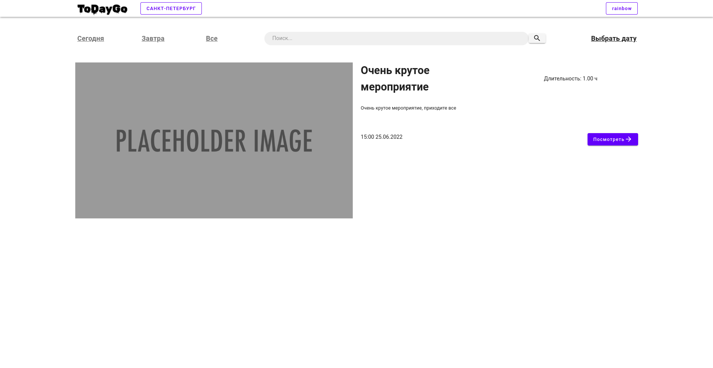
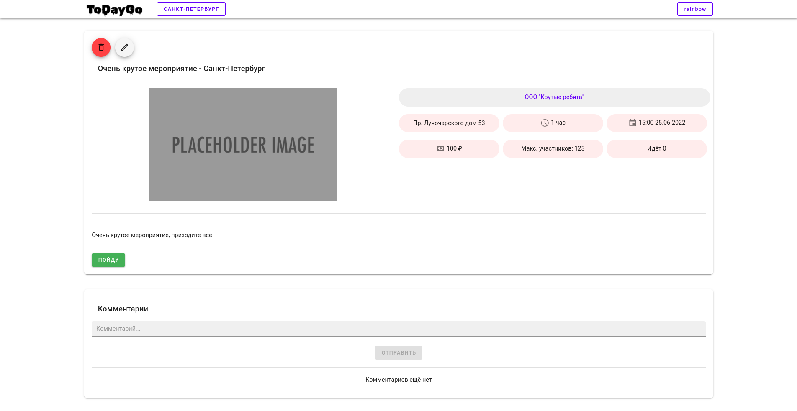
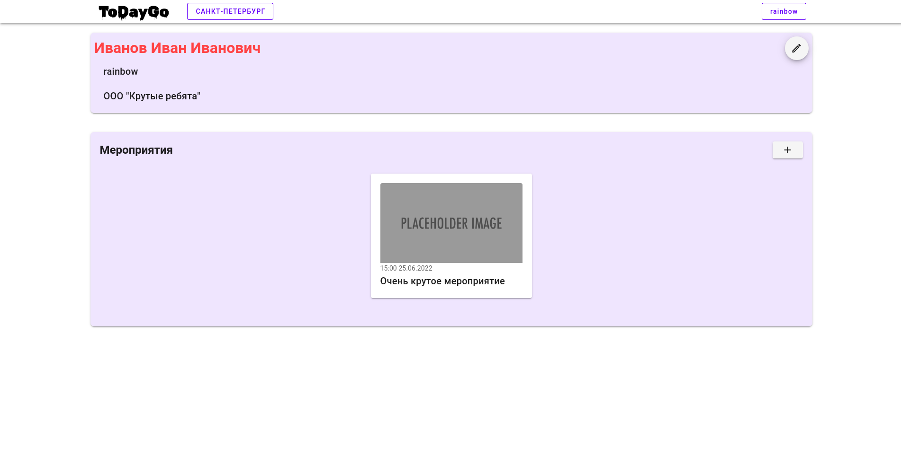
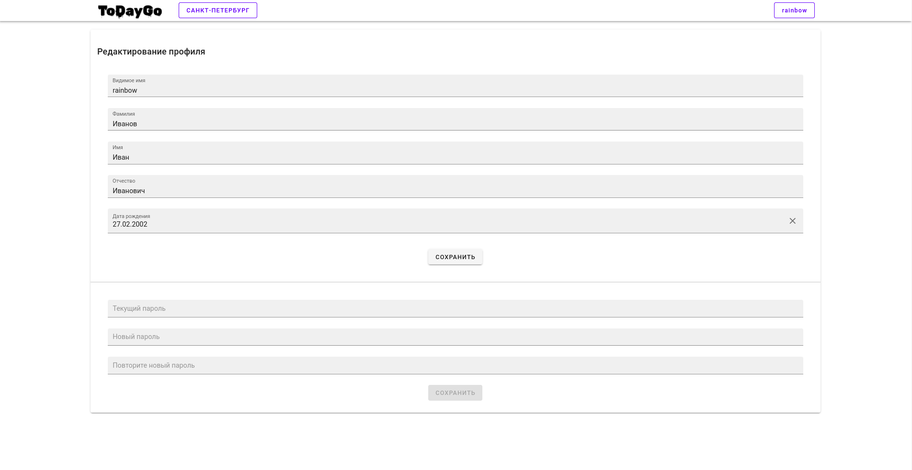
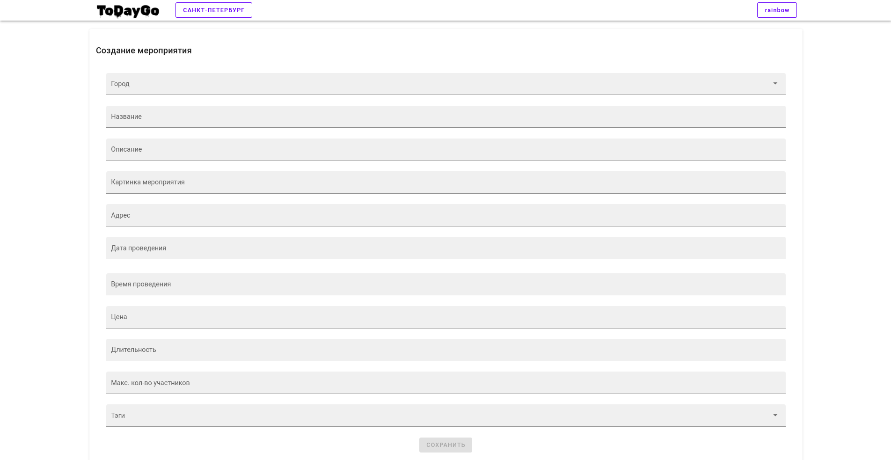
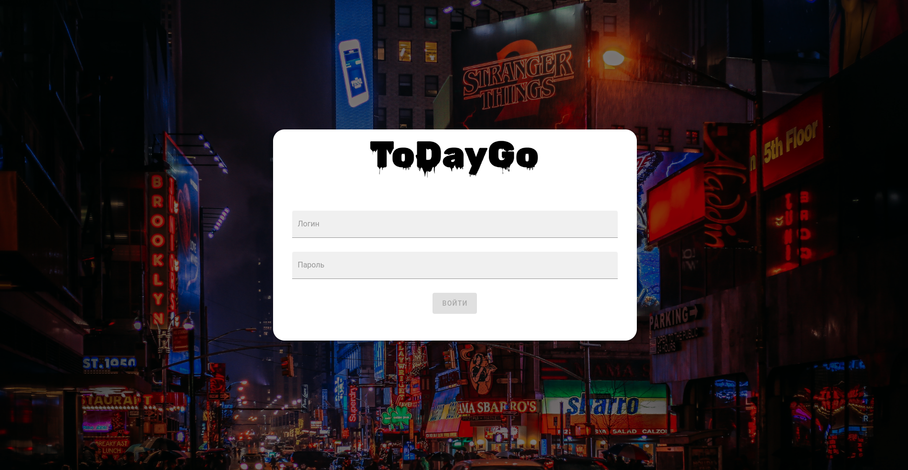
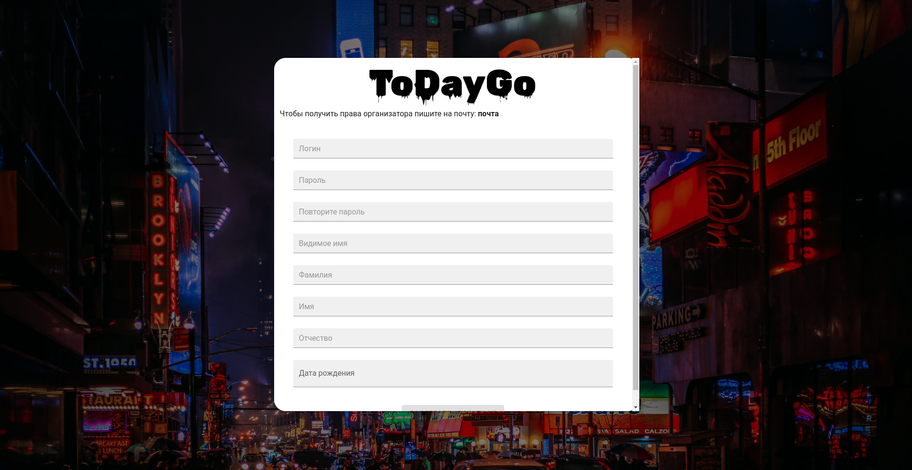
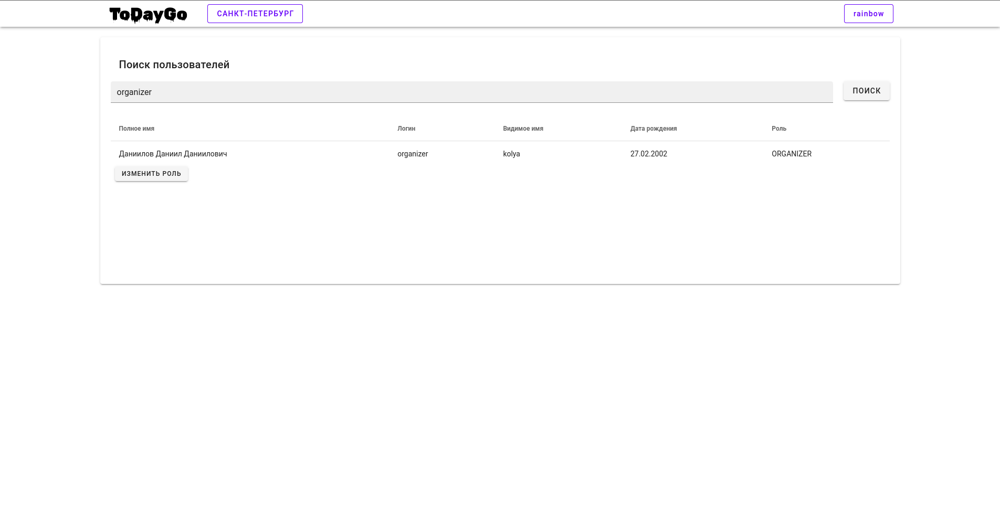

# todaygo_front

*Приложение ещё в разработке, не окончательная версия.*

Сайт для объявлений о мероприятиях. Backend на NestJs https://github.com/DNRAWW/todaygo-backend. На фронте был использован vue2 и vuetify.


## TODO

- [ ] Расширение функционала админки
- [ ] Кнопки "назад" на страницах регистрации и входа
- [ ] Отображение тегов

# Скриншоты

## Главная страница



## Страница мероприятия



## Страница пользователя



## Редактирование профиля



## Создание мероприятия



## Вход



## Регистрация



## Админка



## Project setup
```
npm install
```

### Compiles and hot-reloads for development
```
npm run serve
```

### Compiles and minifies for production
```
npm run build
```

### Lints and fixes files
```
npm run lint
```

### Customize configuration
See [Configuration Reference](https://cli.vuejs.org/config/).
